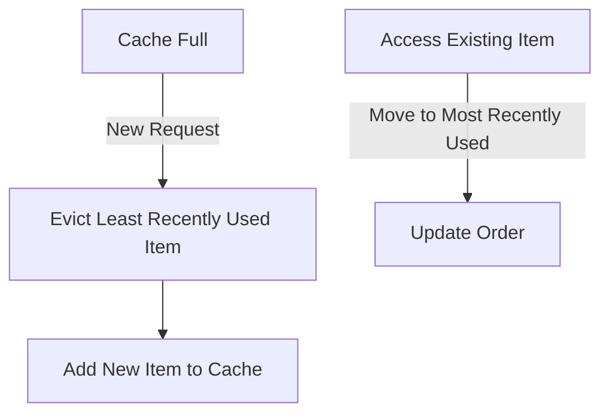
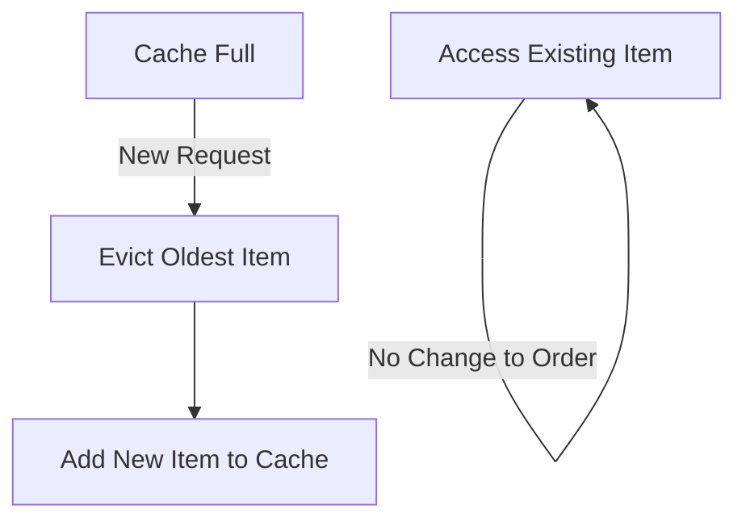
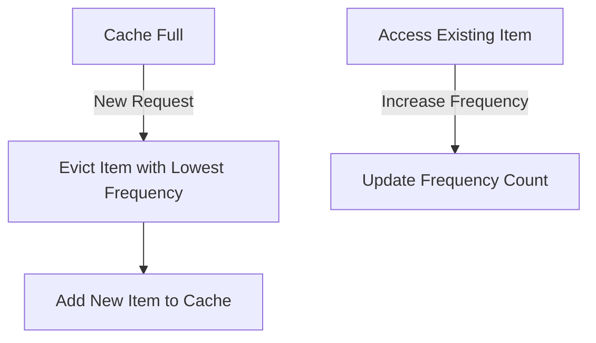
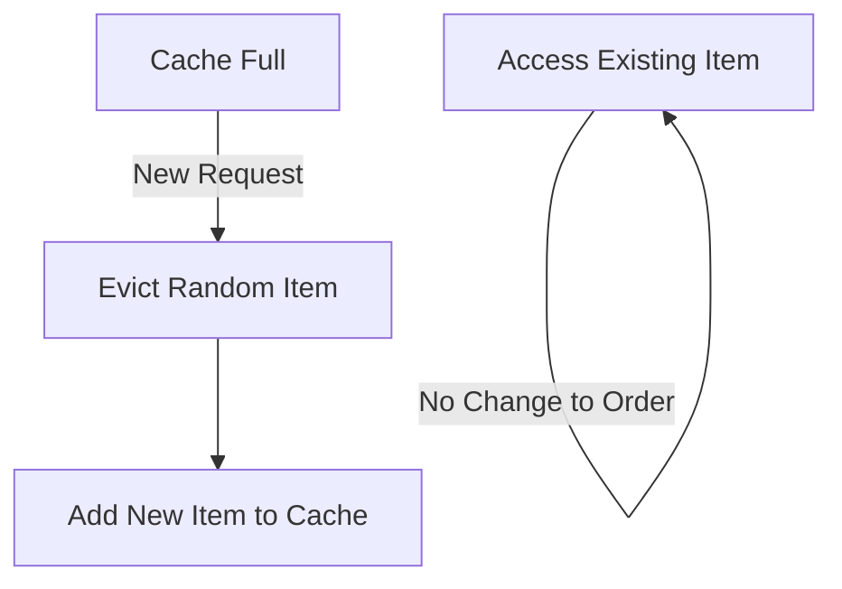
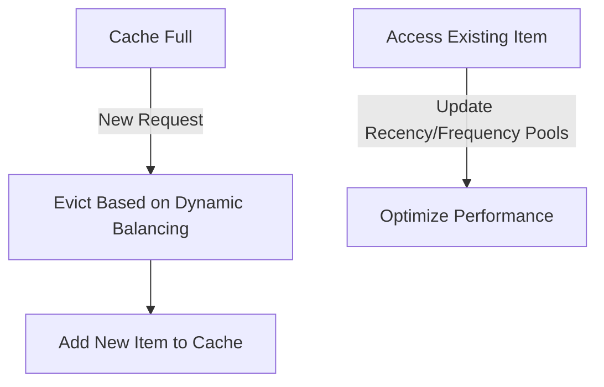

# Top 5 Cache Algorithms Explained

Caching is a cornerstone of performance optimization in computing. Here, we explore the top 5 cache algorithms, their mechanisms, and the situations where they excel.

## 1. Least Recently Used (LRU)

LRU removes the least recently accessed items when the cache is full, ensuring that frequently accessed data remains available.

### How It Works:
1. Each time an item is accessed, it is moved to the top of a priority list.
2. When a new item needs to be added, the item at the bottom of the list (least recently used) is evicted.

### Best Used For:
- Applications with temporal locality (recently accessed data is likely to be accessed again).

---

## 2. First In, First Out (FIFO)

FIFO evicts the oldest items in the cache first, adhering to a straightforward queue-based principle.

### How It Works:
1. Items are added to the cache in the order they arrive.
2. The oldest item (first in) is removed to make space for new entries.

### Best Used For:
- Use cases where the oldest data is least relevant, such as log rotation or buffering.

---

## 3. Least Frequently Used (LFU)

LFU prioritizes eviction based on the frequency of access, keeping frequently accessed items longer.

### How It Works:
1. Every item has a counter that tracks how often it has been accessed.
2. Items with the lowest counters are evicted first.

### Best Used For:
- Systems with consistent access patterns where certain items are predictably accessed more often.

---

## 4. Random Replacement (RR)

Random Replacement evicts a random item when the cache is full, offering a simple yet effective solution.

### How It Works:
1. When the cache reaches capacity, an item is chosen randomly for eviction.
2. The new item is added to the available space.

### Best Used For:
- Environments with unpredictable access patterns or where simplicity is critical.

---

## 5. Adaptive Replacement Cache (ARC)

ARC dynamically adjusts to access patterns, balancing between recency and frequency to optimize performance.

### How It Works:
1. ARC maintains two lists: one for recently used items and another for frequently used items.
2. It dynamically adjusts the balance between these lists based on workload.

### Best Used For:
- Workloads with varying patterns of recency and frequency.

---

## Conclusion

Each of these cache algorithms serves a specific purpose, and their effectiveness depends on the access patterns of your application. Understanding these mechanisms can help developers choose the right strategy to optimize cache performance.
