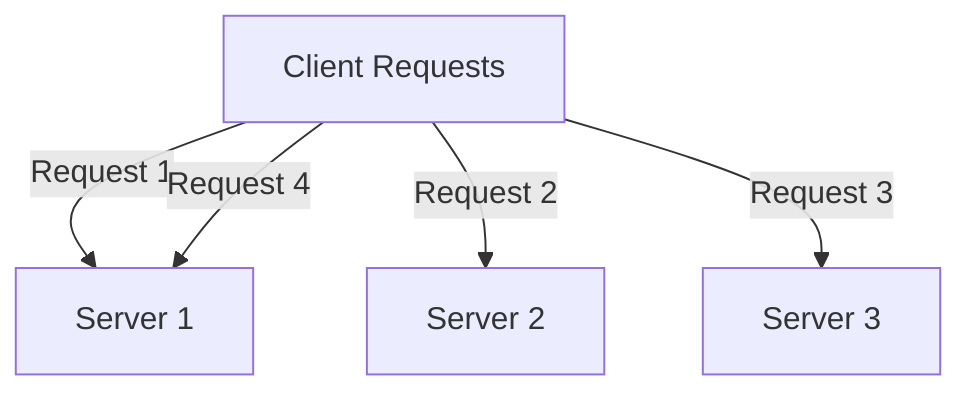

# Top 5 Load Balancing Algorithms Explained

Load balancing ensures efficient distribution of traffic across multiple servers to optimize resource utilization, minimize latency, and prevent overload. Here are the top 5 load balancing algorithms, their use cases, and how they work.

---

## 1. Round Robin

Round Robin distributes client requests sequentially across the available servers.



### Use Case:
- Suitable for systems with servers of equal capacity and consistent workloads.

### Key Features:
- Simple to implement.
- Equal load distribution under uniform conditions.

---

## 2. Weighted Round Robin

An enhanced version of Round Robin, this algorithm assigns weights to servers based on their capacities.

```mermaid
graph TD
    A[Client Requests] -->|Request 1| S1[Server 1 (Weight 3)]
    A -->|Request 2| S1
    A -->|Request 3| S1
    A -->|Request 4| S2[Server 2 (Weight 2)]
    A -->|Request 5| S2
    A -->|Request 6| S3[Server 3 (Weight 1)]
```

### Use Case:
- Ideal for scenarios where servers have different processing capabilities.

### Key Features:
- Distributes load proportionally to server capacity.
- Prevents overloading weaker servers.

---

## 3. Least Connections

This algorithm routes traffic to the server with the fewest active connections.

```mermaid
graph TD
    A[Client Requests] -->|Request 1| S1[Server 1 (5 Connections)]
    A -->|Request 2| S2[Server 2 (3 Connections)]
    A -->|Request 3| S2
    A -->|Request 4| S3[Server 3 (2 Connections)]
```

### Use Case:
- Best for systems with long-lived connections, such as database servers.

### Key Features:
- Dynamically balances load based on active connection counts.
- Prevents overloading servers with high traffic.

---

## 4. IP Hash

IP Hash uses a hash function on the client’s IP address to determine the server assignment.

```mermaid
graph TD
    A[Client 192.168.1.1] -->|Hash(IP)| S1[Server 1]
    B[Client 192.168.1.2] -->|Hash(IP)| S2[Server 2]
    C[Client 192.168.1.3] -->|Hash(IP)| S3[Server 3]
```

### Use Case:
- Useful for scenarios requiring session persistence, such as e-commerce applications.

### Key Features:
- Ensures the same client is routed to the same server.
- Maintains session continuity.

---

## 5. Random

The Random algorithm selects a server at random for each incoming request.


### Use Case:
- Works well in evenly distributed and stateless environments.

### Key Features:
- Simple and easy to implement.
- Avoids patterns or predictability in load distribution.

---

## Conclusion

Selecting the right load balancing algorithm depends on your application’s architecture, server capabilities, and traffic patterns. By understanding these algorithms and their use cases, you can optimize load distribution and ensure high availability for your systems.
